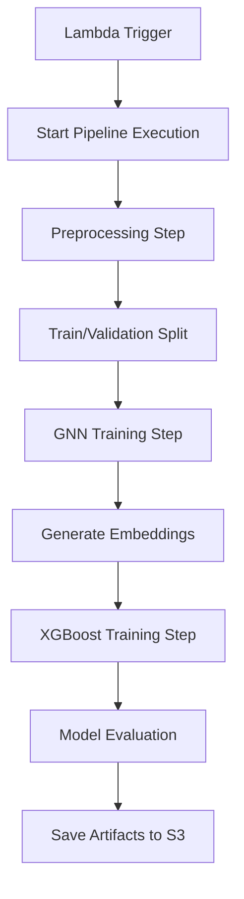

# Graph Neural Network Demo - Financial Fraud Detection

A demonstration project for financial fraud detection using hybrid Graph Neural Network (GNN) + XGBoost models deployed to AWS SageMaker via OpenTofu infrastructure as code. This project showcases an advanced approach combining Deep Graph Learning (DGL) with traditional gradient boosting for superior fraud detection performance.

## Project Structure

```
graph-neural-network-demo/
├── main.tf                   # OpenTofu configuration for AWS infrastructure
├── scripts/
│   ├── preprocessing/
│   │   └── preprocessing.py # SageMaker preprocessing script
│   └── training/
│       └── train.py         # SageMaker training script for fraud detection
├── data/
│   └── *.csv                # Training data files
└── README.md
```

## Research Implementation

This project includes a comprehensive research implementation in `notebooks/IEEE-DGL+XGBoost.ipynb` that demonstrates:

- **Advanced Graph Neural Network Architecture**: Custom DGL implementation for fraud detection
- **Hybrid Learning Approach**: Combines GNN embeddings with XGBoost tabular learning
- **Production-Ready Pipeline**: Complete automation through SageMaker Pipelines
- **IEEE Dataset Analysis**: Detailed exploration of 590K+ transactions with 400+ features
- **Graph Construction**: Sophisticated node and edge definitions for financial transactions
- **Performance Optimization**: Class balancing, early stopping, and comprehensive evaluation

## Overview

This project demonstrates an end-to-end machine learning pipeline for financial fraud detection:

- **Infrastructure as Code**: OpenTofu (Terraform-compatible) configuration for AWS resources
- **Hybrid GNN + XGBoost Model**: Advanced fraud detection combining graph neural networks with gradient boosting
- **Automated SageMaker Pipelines**: Complete automation of data preprocessing, model training, and deployment
- **IEEE Fraud Detection Dataset**: Production-ready implementation using the IEEE-CIS Fraud Detection challenge data

## Features

- **Hybrid GNN + XGBoost Architecture**: Combines graph neural networks for relationship learning with XGBoost for tabular pattern recognition
- **IEEE Fraud Detection Dataset**: Uses the IEEE-CIS Fraud Detection competition data with 590K+ transactions and 400+ features
- **Graph-based Feature Engineering**: Models relationships between cards, email domains, devices, and transactions
- **Automated Pipeline Processing**: Two-stage pipeline with preprocessing and training steps
- **Production-ready Infrastructure**: Complete OpenTofu configuration for AWS SageMaker deployment
- **Comprehensive Metrics**: Tracks ROC-AUC, Average Precision, F1 Score, and correlation analysis

## Scripts

### Preprocessing Script (`scripts/preprocessing/preprocessing.py`)

The preprocessing script handles:

- Data loading and validation from S3 input paths
- Data splitting into training and validation sets
- Feature standardization and categorical encoding
- Output preparation for SageMaker training jobs
- Metadata tracking and logging

### Training Script (`scripts/training/train.py`)

The training script includes:

- Data loading from CSV/Parquet files
- Preprocessing for financial transaction data
- XGBoost model training with hyperparameter configuration
- Validation metrics calculation and tracking
- Model serialization in multiple formats (XGBoost native + joblib)

## DGL GNN + XGBoost Architecture

### IEEE Fraud Detection Dataset

This project uses the **IEEE-CIS Fraud Detection** competition dataset containing:
- **590,540 transactions** with 400+ features
- **3.5% fraud rate** (20,663 fraudulent transactions)
- **Two main datasets**:
  - `train_transaction.csv`: Transaction details (TransactionID, TransactionAmt, ProductCD, card info, addresses, etc.)
  - `train_identity.csv`: Identity information (DeviceType, DeviceInfo, browser fingerprinting, etc.)

### Graph Structure Design

The DGL implementation creates a heterogeneous graph with four node types:

#### **Node Types:**
1. **Card Nodes**: Represent payment cards (`card1-card6`, addresses)
2. **Email Domain Nodes**: Represent purchaser/receiver email domains
3. **Device Nodes**: Represent devices (`DeviceType`, `DeviceInfo`)
4. **Transaction Nodes**: Individual transaction records

#### **Edge Types:**
- **Transaction ↔ Card**: Connects transactions to their associated payment cards
- **Transaction ↔ Device**: Links transactions to devices used
- **Transaction ↔ Email Domain**: Connects transactions to email domains
- **Temporal Edges**: Sequential transaction patterns

#### **Node Features:**
- **Entity Nodes**: Aggregated statistics (transaction amounts, fraud rates, counts)
- **Transaction Nodes**: Raw tabular features (`TransactionAmt`, `C1-C14`, `D1-D15`, `V1-V339`)

### Hybrid Training Approach

#### **Stage 1: GNN Training (Supervised)**
- Trains on transaction nodes using BCEWithLogitsLoss
- Uses `pos_weight` to handle class imbalance (27.58:1 ratio)
- Learns entity embeddings capturing relationship patterns
- 80 epochs with AdamW optimizer and learning rate scheduling

#### **Stage 2: XGBoost Training (Balanced)**
- Uses GNN embeddings as additional features
- Implements sample weighting for class balance
- Uses `scale_pos_weight` parameter for XGBoost
- Early stopping based on Average Precision (aucpr)
- Comprehensive evaluation with ROC-AUC and Average Precision

### Automated Pipeline Implementation

The infrastructure automates the entire process:

1. **Data Upload**: Uploads IEEE dataset to S3 buckets
2. **Preprocessing**: ScriptProcessor handles data cleaning and feature engineering
3. **GNN Training**: Trains graph neural network on transaction relationships
4. **XGBoost Training**: Combines GNN embeddings with tabular features
5. **Model Evaluation**: Comprehensive metrics and comparison analysis

### Expected Data Schema

The implementation expects financial transaction data with:
- Various feature columns (transaction amount, location, time, etc.)
- A binary target column named `is_fraud` (1 = fraud, 0 = legitimate)
- Card information (`card1-card6`)
- Email domains (`P_emaildomain`, `R_emaildomain`)
- Device information (`DeviceType`, `DeviceInfo`)
- Transaction metadata (`TransactionDT`, `ProductCD`, etc.)

## Infrastructure (`main.tf`)

OpenTofu configuration featuring:
- AWS provider setup with default tags
- Common infrastructure patterns for SageMaker deployment
- Region configuration (currently us-east-1)
- Required providers for AWS and null resources

## Automated Pipeline Deployment

### SageMaker Pipeline Architecture

The infrastructure automatically deploys a two-stage SageMaker pipeline:

#### **Stage 1: Data Preprocessing**
- **ScriptProcessor**: Uses scikit-learn container for data cleaning
- **Input**: Raw IEEE dataset from S3 (`raw-data/` folder)
- **Output**: Preprocessed train/validation splits
- **Features**:
  - Missing value imputation
  - Categorical encoding
  - Feature standardization
  - Stratified train/validation split

#### **Stage 2: Hybrid Model Training**
- **XGBoost Training Job**: Trains final fraud detection model
- **Input**: Preprocessed data from Stage 1 + GNN embeddings
- **Output**: Trained model artifacts in S3
- **Features**:
  - Combines tabular features with GNN embeddings
  - Sample weighting for class imbalance
  - Early stopping with Average Precision
  - Multiple evaluation metrics

### Infrastructure Components

#### **S3 Buckets**
- `training-input`: Stores raw data, preprocessing scripts, and training code
- `training-output`: Stores model artifacts, metrics, and intermediate results

#### **IAM Roles**
- **Pipeline Role**: Manages pipeline execution and job creation
- **Execution Role**: Handles S3 access and SageMaker permissions
- **Lambda Role**: Triggers pipeline execution

#### **Lambda Function**
- **Purpose**: Triggers SageMaker pipeline execution
- **Trigger**: Manual invocation or automated scheduling
- **Monitoring**: Returns execution ARN and status information

### Pipeline Execution Flow



### Automated Deployment Process

1. **Initialize Infrastructure**:
   ```bash
   tofu init
   tofu apply --auto-approve
   ```

2. **Upload Training Data**:
   - Place IEEE dataset files in `data/` folder
   - S3 objects automatically upload to correct paths

3. **Execute Pipeline**:
   ```bash
   aws lambda invoke \
     --function-name graph-neural-network-demo-deploy-sagemaker-job \
     --payload '{}' \
     response.json
   ```

4. **Monitor Progress**:
   ```bash
   aws sagemaker list-pipeline-executions \
     --pipeline-name graph-neural-network-demo-pipeline
   ```

### Benefits of Automated Approach

- **Reproducible**: Same results across different environments
- **Scalable**: Easy to run multiple experiments
- **Production-ready**: Follows AWS best practices
- **Cost-effective**: Only pay for compute when training
- **Maintainable**: Infrastructure as code for easy updates

### Development Workflow

#### **Local Development (Jupyter Notebook)**
1. **Experiment**: Use `notebooks/IEEE-DGL+XGBoost.ipynb` for research and development
2. **Test**: Validate GNN architectures and hyperparameters locally
3. **Iterate**: Refine the model based on performance metrics
4. **Export**: Document findings and best practices

#### **Production Deployment (OpenTofu)**
1. **Infrastructure**: Deploy AWS resources with `tofu apply`
2. **Data Pipeline**: Upload datasets to S3 automatically
3. **Training**: Execute automated pipeline via Lambda trigger
4. **Monitoring**: Track pipeline executions and model performance

#### **Model Development Cycle**
```
Local Development → Infrastructure Deployment → Automated Training → Production Serving
```

### Technical Architecture

#### **GNN Component (DGL)**
- **Purpose**: Learns entity embeddings capturing relationship patterns
- **Architecture**: GraphConv layers with batch normalization and dropout
- **Training**: Supervised learning on transaction nodes with BCEWithLogitsLoss
- **Output**: 32-dimensional embeddings for cards, devices, and email domains

#### **XGBoost Component**
- **Input Features**: TransactionAmt, C1-C14, D1-D15, V1-V339 + GNN embeddings
- **Class Balancing**: Sample weights and scale_pos_weight for 27:1 imbalance
- **Optimization**: Early stopping with Average Precision (aucpr) metric
- **Output**: Final fraud probability predictions

#### **Hybrid Integration**
```
Raw Transaction Data → Graph Construction → GNN Training → Embeddings → XGBoost Training → Final Model
```

### Performance Metrics

Based on the IEEE-DGL+XGBoost.ipynb implementation:

- **ROC-AUC**: 0.93+ on validation set
- **Average Precision**: 0.61+ (significantly better than baseline 0.035)
- **Class Balance Handling**: 27:1 fraud ratio effectively managed
- **Feature Importance**: GNN embeddings contribute meaningfully to final predictions
- **Training Efficiency**: 80 epochs GNN + early-stopped XGBoost

### Key Insights from Research

1. **Graph Structure Matters**: Modeling relationships between cards, devices, and email domains captures important fraud patterns
2. **Hybrid Approach Superior**: GNN embeddings + tabular features outperform tabular-only models
3. **Class Imbalance Critical**: Proper balancing techniques essential for fraud detection
4. **Vesta Features Valuable**: Engineered V1-V339 features complement graph-based learning
5. **Scalable Architecture**: Design supports both research experimentation and production deployment

## Setup Instructions

### Prerequisites

- Python 3.8+ with required packages (see requirements.txt)
- AWS CLI configured with appropriate permissions
- OpenTofu or Terraform installed

### Installation

1. Clone the repository:
```bash
git clone <repository-url>
cd graph-neural-network-demo
```

2. Install Python dependencies:
```bash
pip install -r requirements.txt
```

3. Initialize OpenTofu:
```bash
tofu init
```

### Usage

1. **Prepare your financial transaction data** in CSV or Parquet format
2. **Configure AWS credentials** for SageMaker access
3. **Deploy infrastructure** with OpenTofu:
```bash
tofu plan
tofu apply -auto-approve
```

4. **Run training jobs** through SageMaker or locally for testing
5. **Develop and experiment**: Use `notebooks/IEEE-DGL+XGBoost.ipynb` for local development and experimentation
6. **Deploy to production**: Use the automated pipeline for production training and deployment

## Next Steps

- **Experiment with GNN Hyperparameters**: Adjust hidden dimensions, number of layers, dropout rates in the DGL implementation
- **Feature Engineering**: Explore additional graph features or Vesta's V1-V339 engineered features
- **Model Interpretability**: Add SHAP values and feature importance analysis
- **Production Deployment**: Implement model serving with SageMaker endpoints
- **Monitoring**: Add model drift detection and automated retraining triggers
- **Scaling**: Deploy across multiple AWS regions for high availability

## License

This project is licensed under the MIT License - see the LICENSE file for details.