# Financial Fraud Detection with GNN + XGBoost on AWS SageMaker

An end-to-end machine learning pipeline for financial fraud detection using Graph Neural Networks (DGL) combined with XGBoost, deployed on AWS SageMaker. This project leverages NVIDIA's cuGraph financial fraud training container to train state-of-the-art models on the IEEE-CIS Fraud Detection dataset, with full infrastructure automation via OpenTofu.

## 🎯 Project Overview

This project demonstrates a production-ready pipeline that:
- **Preprocesses** the IEEE-CIS Fraud Detection dataset using SageMaker Processing Jobs
- **Trains** a hybrid GNN (Graph Neural Network) + XGBoost model using NVIDIA's optimized containers on GPU instances
- **Deploys** the trained model for inference
- **Automates** the entire workflow using OpenTofu (Terraform) infrastructure as code

### Key Technologies
- **NVIDIA cuGraph**: GPU-accelerated graph analytics and GNN training
- **DGL (Deep Graph Library)**: Graph neural network framework
- **XGBoost**: Gradient boosting for tabular features
- **AWS SageMaker**: Managed ML platform for training and deployment
- **OpenTofu**: Infrastructure as code for reproducible deployments

## 📸 Pipeline Snapshots

Visual demonstrations of the key pipeline stages:

### Data Preprocessing Stage
Automated SageMaker Processing Job that transforms raw data into GNN-ready graph format.


### Model Training Stage
GPU-accelerated training using NVIDIA A10G with real-time metrics and loss tracking.


## 📊 Dataset

The project uses the **IEEE-CIS Fraud Detection** dataset, which includes:
- **590,540 transactions** with 434 features after preprocessing
- Transaction data (`train_transaction.csv`) with payment information
- Identity data (`train_identity.csv`) with device and network information
- Highly imbalanced (~3.5% fraud rate)

## 🏗️ Architecture

### System Architecture Diagram

```mermaid
graph TB
    subgraph "Data Sources"
        RAW["📊 Raw Data<br/>train_transaction.csv<br/>train_identity.csv"]
    end
    
    subgraph "OpenTofu Orchestration"
        TF["🏗️ OpenTofu<br/>docker-upload.tf<br/>preprocessing.tf<br/>training.tf"]
    end
    
    subgraph "Container & Credentials"
        NGC["🔐 NGC Registry<br/>nvcr.io/nvidia/<br/>financial-fraud-training"]
        CREDS["🔑 nvidia_credentials.json<br/>NGC API Key"]
        ECR["📦 AWS ECR<br/>financial-fraud-training:1.0.1"]
    end
    
    subgraph "Data Preprocessing"
        PROC["🔄 SageMaker Processing Job<br/>ml.m5.4xlarge<br/>scripts/preprocessing/preprocess.py"]
        PROCOUT["✅ GNN Data Format<br/>- edges/node_to_node.csv<br/>- nodes/node.csv<br/>- node_label.csv"]
    end
    
    subgraph "Model Training"
        TRAIN["🚀 SageMaker Training Job<br/>ml.g5.xlarge GPU<br/>NVIDIA A10G 24GB"]
        WRAPPER["🐚 scripts/training/wrapper.sh<br/>- GPU setup<br/>- pyg-lib fix<br/>- CUDA warmup"]
        CONFIG["⚙️ scripts/training/generate_config.py<br/>GraphSAGE_XGBoost hyperparams"]
        TRAININ["📥 Training Inputs<br/>- GNN data<br/>- Config JSON<br/>- Training scripts"]
    end
    
    subgraph "S3 Storage"
        S3INPUT["📥 Input Bucket<br/>- Raw data<br/>- Scripts<br/>- Config"]
        S3OUTPUT["📤 Output Bucket<br/>- Preprocessed data<br/>- Model artifacts<br/>- Training snapshot"]
    end
    
    subgraph "Model Artifacts"
        MODEL["🎯 Trained Model<br/>model.tar.gz 257MB"]
        MODELREPO["📦 model_repository/<br/>ONNX models for Triton"]
        PYREPO["🐍 python_backend_model_repository/<br/>PyTorch models"]
        SNAPSHOT["📸 training_snapshot/<br/>Config, metadata, code, inputs"]
    end
    
    subgraph "Monitoring & Logs"
        CW["📋 CloudWatch Logs<br/>/aws/sagemaker/<br/>TrainingJobs"]
        SCRIPTS["🔧 retrieve_logs.py<br/>Log analysis utility"]
    end
    
    RAW -->|Upload| S3INPUT
    CREDS -->|Auth| NGC
    NGC -->|Pull| ECR
    TF -->|Orchestrate| PROC
    TF -->|Deploy| TRAIN
    PROC -->|Output| PROCOUT
    PROCOUT -->|Store| S3OUTPUT
    S3INPUT -->|Read| PROC
    S3OUTPUT -->|Read| TRAIN
    ECR -->|Use| WRAPPER
    ECR -->|Use| TRAIN
    CONFIG -->|Generate| TRAININ
    WRAPPER -->|Execute| TRAIN
    TRAININ -->|Feed| TRAIN
    TRAIN -->|Monitor| CW
    CW -->|Analyze| SCRIPTS
    TRAIN -->|Create| MODEL
    MODEL -->|Contains| MODELREPO
    MODEL -->|Contains| PYREPO
    MODEL -->|Contains| SNAPSHOT
    MODEL -->|Store| S3OUTPUT
    
    style RAW fill:#e1f5ff
    style TF fill:#fff3e0
    style NGC fill:#f3e5f5
    style ECR fill:#f3e5f5
    style CREDS fill:#ffebee
    style PROC fill:#e8f5e9
    style PROCOUT fill:#c8e6c9
    style TRAIN fill:#e8f5e9
    style WRAPPER fill:#fff9c4
    style CONFIG fill:#fff9c4
    style TRAININ fill:#ffe0b2
    style S3INPUT fill:#b3e5fc
    style S3OUTPUT fill:#81d4fa
    style MODEL fill:#a5d6a7
    style MODELREPO fill:#81c784
    style PYREPO fill:#81c784
    style SNAPSHOT fill:#81c784
    style CW fill:#bbdefb
    style SCRIPTS fill:#90caf9
```



### Pipeline Stages

#### 1. **Data Preprocessing** (SageMaker Processing Job)
The preprocessing stage (`notebooks/nvidia/preprocessing.ipynb`) performs:
- Merges transaction and identity data
- Feature engineering: categorical encoding, numerical scaling
- Graph construction: Creates bipartite graph connecting transactions → cards → emails
- Time-based train/test split (70/30)
- Outputs data in NVIDIA container format:
  ```
  processed/ieee-fraud-detection/
  ├── gnn/
  │   ├── train_gnn/
  │   │   ├── edges/node_to_node.csv
  │   │   └── nodes/
  │   │       ├── node.csv (features)
  │   │       ├── node_label.csv (fraud labels)
  │   │       └── offset_range_of_training_node.json
  │   └── test/
  │       ├── edges/node_to_node.csv
  │       └── nodes/
  └── xgb/
      ├── training.csv
      ├── test.csv
      └── feature_info.json
  ```

#### 2. **Container Management** (`docker-upload.tf`)
- Creates AWS ECR repository for the NVIDIA container
- Pulls `nvcr.io/nvidia/cugraph/financial-fraud-training:1.0.1` (33GB GPU-optimized image)
- Authenticates with NGC (NVIDIA GPU Cloud) using credentials from `nvidia_credentials.json`
- Tags and pushes to ECR for SageMaker training jobs
- Implements idempotent checks to skip if image already exists

#### 3. **Model Training** (SageMaker Training Job)
The training stage (`notebooks/nvidia/training-job.ipynb`) configures:
- **Model Architecture**: GraphSAGE GNN + XGBoost ensemble
- **GPU Instance**: ml.g5.xlarge or similar (NVIDIA A10G)
- **Training Config** (`training_config.json`):
  ```json
  {
    "model_type": "graphsage_xgboost",
    "data_dir": "/opt/ml/input/data/training",
    "output_dir": "/opt/ml/model",
    "gnn_config": {
      "hidden_dim": 128,
      "num_layers": 3,
      "dropout": 0.2,
      "learning_rate": 0.001
    },
    "xgb_config": {
      "max_depth": 6,
      "learning_rate": 0.1,
      "n_estimators": 100,
      "scale_pos_weight": 27.43
    }
  }
  ```

#### 4. **Deployment** (Future)
- SageMaker Endpoint for real-time inference
- Batch transform for bulk predictions

## 🚀 Getting Started

### Prerequisites

1. **AWS Account** with SageMaker access
2. **NVIDIA NGC Account** for container access ([sign up](https://ngc.nvidia.com/))
3. **OpenTofu** (or Terraform) installed
4. **Docker** installed locally
5. **AWS CLI** configured with credentials

### Setup Instructions

#### 1. Configure NVIDIA Credentials
Create `nvidia_credentials.json` at the project root (excluded from git):
```json
{
  "ngc_api_key": "YOUR_NGC_API_KEY_HERE"
}
```

Get your NGC API key from: https://ngc.nvidia.com/setup/api-key

#### 2. Upload Container to ECR
```bash
# Initialize OpenTofu
tofu init -upgrade

# Deploy ECR repository and upload NVIDIA container
tofu apply -auto-approve
```

This will:
- Create the ECR repository `financial-fraud-training`
- Pull the 33GB NVIDIA container from NGC (first run only)
- Push to your ECR registry

#### 3. Run Preprocessing Job (Automated via OpenTofu)

The preprocessing infrastructure is fully automated using OpenTofu. The `preprocessing.tf` file will:
- Create IAM roles with necessary permissions
- Upload the preprocessing script to S3
- Check if preprocessed data already exists (skip if present)
- Launch a SageMaker Processing Job on `ml.m5.4xlarge`
- Monitor job completion (10-20 minutes)
- Verify all output files are created correctly

```bash
# The preprocessing job is automatically triggered during tofu apply
# It will skip if preprocessed data already exists in S3
tofu apply -auto-approve
```

**✅ Status**: Preprocessing infrastructure fully validated and operational!

#### End-to-End Validation Results (October 21, 2025)

The complete pipeline has been tested with full data deletion and recreation:

**Test Execution:**
- ✅ Deleted all preprocessed data from S3
- ✅ Tainted Terraform state to force resource recreation
- ✅ Re-ran `tofu apply -auto-approve` from scratch
- ✅ Job completed successfully in **16m18s**
- ✅ All 10 output files verified with correct sizes

**Preprocessing Job Details:**
- Job Name: `fraud-detection-preprocessing-20251021-224642`
- Instance Type: `ml.m5.4xlarge` with 30GB storage
- Status: Completed at 2025-10-21 23:02:23 UTC
- Total Data Generated: ~8.0 GB

**Output Files Verified:**
| File | Size |
|------|------|
| gnn/train_gnn/edges/node_to_node.csv | 26.1 MB |
| gnn/train_gnn/nodes/node.csv | 2.42 GB |
| gnn/train_gnn/nodes/node_label.csv | 827 KB |
| gnn/train_gnn/nodes/offset_range_of_training_node.json | 37 B |
| gnn/test/edges/node_to_node.csv | 10.8 MB |
| gnn/test/nodes/node.csv | 1.04 GB |
| gnn/test/nodes/node_label.csv | 354 KB |
| xgb/training.csv | 2.42 GB |
| xgb/test.csv | 1.04 GB |
| xgb/feature_info.json | 9.6 KB |

**Infrastructure Components Validated:**
- [x] IAM roles and permissions
- [x] S3 input/output buckets
- [x] SageMaker Processing Job orchestration
- [x] AWS CLI integration and error handling
- [x] Pre-check logic (skips job if data exists)
- [x] Job status monitoring with 3-minute timeout
- [x] Automatic output verification
- [x] Idempotency (multiple runs don't create duplicate jobs)

#### Idempotency Validation (Confirmed)

**Test Objective**: Verify that running `tofu apply -auto-approve` when preprocessed data already exists in S3 does NOT trigger the preprocessing job again.

**Test Results:**
- ✅ Re-ran `tofu apply -auto-approve` with existing S3 data
- ✅ OpenTofu Output: "No changes. Your infrastructure matches the configuration."
- ✅ Resources created: **0** | Resources changed: **0** | Resources destroyed: **0**
- ✅ Preprocessing job: **NOT triggered** (correctly skipped)
- ✅ S3 data verification: All 11 preprocessed files remain intact
- ✅ Cost optimization: No redundant job execution = no extra charges

**Idempotency Mechanism (Two-Layer Protection):**

1. **Terraform State Layer** (Primary):
   - The `null_resource.run_preprocessing_job` uses triggers based on:
     - Preprocessing script hash (`scripts/preprocessing/preprocess.py`)
     - Input data hashes (`train_transaction.csv`, `train_identity.csv`)
     - IAM role ARN
   - When these hashes/values haven't changed, the resource is not replaced
   - Therefore, the `local-exec` provisioner does NOT run

2. **Local-Exec Layer** (Backup Safeguard):
   - Even if the provisioner runs, the bash script includes a pre-check
   - Checks if all required files exist in S3 before job creation
   - If all files found → skips job creation and exits gracefully
   - If any missing → proceeds with job creation

**Cost Implications:**
- Idempotency prevents unnecessary SageMaker Processing Job executions
- No duplicate data generation or storage redundancy
- Estimated savings: **$0.50-$1.00 per redundant run** on ml.m5.4xlarge instance

#### Retrieving CloudWatch Logs

A utility script is provided to inspect SageMaker Processing Job logs:

```bash
# Retrieve logs for latest preprocessing job
python scripts/preprocessing/retrieve_logs.py

# Retrieve logs for specific job
python scripts/preprocessing/retrieve_logs.py fraud-detection-preprocessing-20251021-224642

# Retrieve logs for specific region
python scripts/preprocessing/retrieve_logs.py fraud-detection-preprocessing-20251021-224642 us-west-2
```

**Requirements:** `boto3` installed in Python environment

**Manual preprocessing alternative** (for debugging):
```bash
# If needed, you can still run the preprocessing notebook manually
jupyter notebook notebooks/nvidia/preprocessing.ipynb
```

#### 4. Train the Model (Automated via OpenTofu)

The training infrastructure is fully automated using OpenTofu, similar to the preprocessing pipeline. The `training.tf` file orchestrates the complete training workflow:

**What `training.tf` Does:**
- Creates IAM roles with SageMaker, S3, and ECR permissions
- Uploads wrapper script and configuration generator to S3
- Generates training configuration (GraphSAGE + XGBoost hyperparameters)
- Validates preprocessed data exists before starting training
- Launches SageMaker Training Job on `ml.g5.xlarge` (GPU-equipped)
- Monitors job status every 30 seconds with 3-minute registration timeout
- Verifies all model outputs (model.tar.gz with 2.4 GB artifacts)
- Creates comprehensive training snapshots (metadata, code, artifacts)
- Implements cost optimization (skips if model already exists)

**Training Configuration:**
```json
{
  "Model": "GraphSAGE_XGBoost",
  "GPU": "Single A10G (24GB)",
  "GNN": {
    "hidden_channels": 32,
    "n_hops": 2,
    "dropout_prob": 0.2,
    "batch_size": 1024,
    "num_epochs": 20
  },
  "XGBoost": {
    "max_depth": 8,
    "learning_rate": 0.1,
    "num_parallel_tree": 1,
    "num_boost_round": 1000,
    "gamma": 1.0
  }
}
```

**Deploy Training Job:**
```bash
# The training job is automatically triggered during tofu apply
# Prerequisites: preprocessed data must exist in S3
tofu apply -auto-approve
```

**Expected Execution Time:** 12-15 minutes on GPU

**Training Job Output:**
- `model.tar.gz` (2.4 GB) containing:
  - `model_repository/` - ONNX models for Triton inference
  - `python_backend_model_repository/` - PyTorch backend models
  - `training_snapshot/` - Complete training metadata and artifacts

#### Training Infrastructure Components

**Files:**
- `training.tf` - Complete orchestration and monitoring
- `scripts/training/wrapper.sh` - NVIDIA container setup + training launcher
- `scripts/training/generate_config.py` - Hyperparameter configuration generator

**Infrastructure Stack:**
- [x] IAM roles with proper permissions
- [x] S3 management for scripts and outputs
- [x] ECR image verification
- [x] Configuration generation and upload
- [x] SageMaker Training Job creation via AWS CLI
- [x] Real-time status monitoring (every 30s)
- [x] 3-minute timeout for job registration
- [x] Output verification and artifact cataloging
- [x] Training snapshot creation
- [x] Idempotency checks (skips if model exists)

#### Current Status & Known Issues

**✅ Completed:**
- Training infrastructure code fully implemented
- All automation scripts tested and debugged
- Committed to main branch (commit: 2e40101)
- NGC API credentials properly integrated
- Two-layer idempotency mechanism in place
- **End-to-end training execution successful** (October 22, 2025)
  - Job Name: `fraud-detection-training-22-Oct-2025-01-13-49`
  - Execution Time: ~12 minutes
  - GPU Instance: ml.g5.xlarge (NVIDIA A10G 24GB)
  - Model Output: model.tar.gz (257 MB) with all artifacts verified
  - Timestamp format: Human-readable (dd-Mon-YYYY-HH-MM-SS)
  - Idempotency: Confirmed - subsequent runs skip job when output exists
  - Temporary files: Using `.log` extension with gitignore patterns

**✅ All Systems Operational:**
- [x] ECR container management (docker-upload.tf)
- [x] Data preprocessing automation (preprocessing.tf)
- [x] Model training automation (training.tf)
- [x] Real-time monitoring and logging
- [x] S3 artifact management
- [x] Output verification and validation
- [x] Cost optimization (idempotency checks)
- [x] Comprehensive documentation

**🔧 Next Steps (Next Session):**
1. Fix S3 path reference in training.tf (1 minute)
2. Run `tofu apply -auto-approve` to submit training job
3. Monitor CloudWatch logs during execution (12-15 minutes)
4. Verify model outputs in S3
5. Proceed with model deployment

**Manual Training Alternative** (for debugging):
```bash
# If needed, you can still run the training notebook manually
jupyter notebook notebooks/nvidia/training-job.ipynb
```

## 🧩 Using the NVIDIA Container on SageMaker (ECR + entrypoint override)

SageMaker cannot pull directly from NGC. We make the NVIDIA container work in AWS by:

- Uploading the NVIDIA image to your private ECR using OpenTofu (`docker-upload.tf`):
  - Logs in to NGC with `nvidia_credentials.json`
  - Pulls `nvcr.io/nvidia/cugraph/financial-fraud-training:1.0.1`
  - Tags and pushes it to `ACCOUNT_ID.dkr.ecr.REGION.amazonaws.com/financial-fraud-training:1.0.1`
  - Skips the upload if the tag already exists

- Overriding the container entrypoint in SageMaker Training Jobs to run a wrapper script instead of the default container entrypoint:
  - `container_entry_point=["bash", "/opt/ml/input/data/scripts/wrapper.sh"]`

This approach preserves the vendor container while giving us full control to prepare the environment and launch training in a SageMaker-friendly way.

### 🔧 Wrapper entrypoint (what it does)
The wrapper script (generated and uploaded from `notebooks/nvidia/training-job.ipynb`) runs inside the container and:
- Verifies GPU availability (`nvidia-smi`, basic CUDA checks)
- Fixes `pyg-lib` compatibility for the container’s Torch/CUDA version (uninstall + reinstall from `data.pyg.org`)
- Sets `PYTHONPATH=/opt/nim` so we can import the NVIDIA training code
- Warms up CUDA to initialize device/context
- Reads `/opt/ml/input/data/config/config.json` (created from preprocessing outputs)
- Launches a small Python driver that calls `validate_config_and_run_training` from NVIDIA’s package
- Creates a training snapshot under `/opt/ml/model/training_snapshot` including:
  - Config files used
  - Input data channels copied from `/opt/ml/input/data/`
  - Environment and system info (Python packages, GPU details)
  - A code snapshot of the container training sources

### 🧪 SageMaker Estimator and fit configuration (snapshot)
Below is a minimal snapshot of how the estimator and inputs are configured (see `notebooks/nvidia/training-job.ipynb` for the full version):

```python
import os, boto3, sagemaker
from sagemaker.estimator import Estimator
from sagemaker.debugger import ProfilerConfig, FrameworkProfile, DetailedProfilingConfig

session = sagemaker.Session()
region = session.boto_region_name
account_id = boto3.client('sts').get_caller_identity()['Account']

ecr_image_name = "financial-fraud-training"
ecr_image_tag = "1.0.1"
image_uri = f"{account_id}.dkr.ecr.{region}.amazonaws.com/{ecr_image_name}:{ecr_image_tag}"

bucket = f"sagemaker-{region}-{account_id}"
S3_PREPROCESS_DATA_PATH = f"s3://{bucket}/processed/ieee-fraud-detection/"
S3_OUTPUT_DATA_PATH = f"s3://{bucket}/output/ieee-fraud-detection/"

# Load NGC key from repo root JSON (see README setup)
import json
with open('nvidia_credentials.json', 'r', encoding='utf-8') as f:
    NGC_API_KEY = json.load(f)["ngc_api_key"]

estimator = Estimator(
    image_uri=image_uri,
    role=sagemaker.get_execution_role(),
    instance_count=1,
    instance_type="ml.g5.xlarge",
    volume_size=30,
    max_run=86400,
    base_job_name="fraud-detection-gnn",
    output_path=S3_OUTPUT_DATA_PATH,
    sagemaker_session=session,
    container_entry_point=["bash", "/opt/ml/input/data/scripts/wrapper.sh"],
    environment={
        "NIM_DISABLE_MODEL_DOWNLOAD": "true",
        "NGC_API_KEY": NGC_API_KEY,
        "PYTHONUNBUFFERED": "1",
    },
    profiler_config=ProfilerConfig(
        system_monitor_interval_millis=500,
        framework_profile_params=FrameworkProfile(
            detailed_profiling_config=DetailedProfilingConfig(start_step=0, num_steps=10)
        ),
    ),
)

inputs = {
    "gnn": sagemaker.inputs.TrainingInput(
        s3_data=os.path.join(S3_PREPROCESS_DATA_PATH, "gnn/train_gnn/"),
        content_type="application/x-directory",
        input_mode="File",
    ),
    "config": sagemaker.inputs.TrainingInput(
        s3_data=os.path.join(S3_PREPROCESS_DATA_PATH, "config"),
        content_type="application/x-directory",
        input_mode="File",
    ),
    "scripts": sagemaker.inputs.TrainingInput(
        s3_data=os.path.join(S3_PREPROCESS_DATA_PATH, "scripts/wrapper.sh"),
        content_type="text/x-sh",
        input_mode="File",
    ),
}

from datetime import datetime
job_name = f"fraud-detection-gnn-{datetime.now().strftime('%d-%b-%Y-%H-%M-%S')}"

estimator.fit(inputs=inputs, job_name=job_name, logs=["All"], wait=True)
```

## 📁 Project Structure

```
aws-nvidia-dgl-gnn-xgboost/
├── data/                           # Raw IEEE dataset (gitignored)
│   ├── train_identity.csv
│   └── train_transaction.csv
├── docker-upload.tf                # OpenTofu config for NVIDIA container
├── preprocessing.tf                # SageMaker preprocessing job automation
├── nvidia_credentials.json         # NGC API key (gitignored)
├── notebooks/
│   └── nvidia/
│       ├── preprocessing.ipynb     # Manual preprocessing (for debugging)
│       ├── download-upload-ecr.ipynb  # Container management notebook
│       └── training-job.ipynb      # SageMaker training job launcher
├── scripts/
│   ├── preprocessing/
│   │   └── preprocess.py           # Preprocessing script for SageMaker
│   └── training/
│       └── train.py                # Custom training script (if needed)
├── provider.tf                     # AWS provider configuration
├── s3.tf                           # S3 bucket for data/models
├── vpc.tf                          # VPC configuration for SageMaker
└── README.md
```

## 🔧 Infrastructure Components

### OpenTofu Resources
- **ECR Repository**: Stores NVIDIA training container
- **S3 Buckets**: Data storage and model artifacts
- **VPC**: Network isolation for SageMaker jobs
- **IAM Roles**: SageMaker execution permissions for processing and training
- **Processing Jobs**: Automated data preprocessing infrastructure

### Key Files
- `docker-upload.tf`: Automates container pull/push from NGC to ECR
- `preprocessing.tf`: Automated SageMaker preprocessing job deployment with monitoring
- `scripts/preprocessing/preprocess.py`: Data preprocessing script for graph creation
- `nvidia_credentials.json`: Secure storage for NGC API key (in .gitignore)
- `locals.tf`: Common tags and configuration variables

## 📊 Model Performance

The hybrid GNN + XGBoost approach provides:
- **Graph Learning**: GraphSAGE captures relationship patterns between transactions, cards, and emails
- **Tabular Features**: XGBoost leverages traditional fraud indicators
- **Ensemble Benefits**: Combines structural and feature-based signals

Expected performance on IEEE dataset:
- **AUC-ROC**: ~0.92-0.95
- **F1-Score**: ~0.70-0.75 (with threshold tuning)

## 🔒 Security Notes

- `nvidia_credentials.json` is in `.gitignore` - never commit credentials
- Use IAM roles for SageMaker instead of hardcoded AWS keys
- ECR repositories use AES256 encryption
- Training jobs run in private VPC subnets

## 🐛 Troubleshooting

### Container Pull Issues
```bash
# Check if image exists in ECR
aws ecr describe-images --repository-name financial-fraud-training --region us-east-1

# Force re-pull by deleting ECR image
aws ecr batch-delete-image --repository-name financial-fraud-training --image-ids imageTag=1.0.1
tofu apply -auto-approve
```

### Training Job Failures
- Check CloudWatch logs: `/aws/sagemaker/TrainingJobs`
- Verify S3 paths in training config
- Ensure GPU instance quota is available
- Validate preprocessed data structure

## 📚 References

- [NVIDIA cuGraph Documentation](https://docs.rapids.ai/api/cugraph/stable/)
- [DGL Documentation](https://docs.dgl.ai/)
- [IEEE-CIS Fraud Detection Dataset](https://www.kaggle.com/c/ieee-fraud-detection)
- [AWS SageMaker Training Jobs](https://docs.aws.amazon.com/sagemaker/latest/dg/how-it-works-training.html)

## 📝 License

This project is for demonstration purposes. Check individual component licenses:
- NVIDIA containers: [NGC License](https://ngc.nvidia.com/legal)
- IEEE dataset: Kaggle competition terms

## 🤝 Contributing

Contributions welcome! Please:
1. Fork the repository
2. Create a feature branch
3. Test changes with `tofu plan`
4. Submit a pull request

---

**Note**: This pipeline requires GPU instances for training. Typical training time: 15-30 minutes on ml.g5.xlarge for the full IEEE dataset.