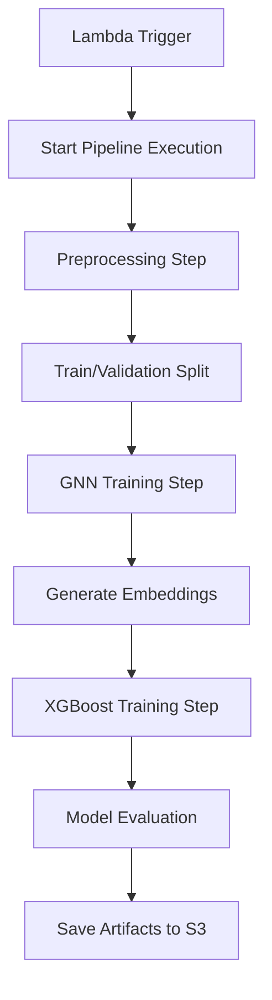

# Financial Fraud Detection with Advanced Monitoring

A comprehensive demonstration project for financial fraud detection deployed to AWS SageMaker via OpenTofu infrastructure as code. This project showcases a production-ready machine learning pipeline with advanced monitoring, debugging, and SageMaker Studio integration. Features include automated pipeline monitoring, intelligent error detection, and comprehensive troubleshooting capabilities.

## Project Structure

```
graph-neural-network-demo/
├── main.tf                   # OpenTofu configuration for AWS infrastructure
├── studio.tf                 # SageMaker Studio domain and admin user setup
├── pipeline.tf               # SageMaker pipeline configuration with monitoring
├── scripts/
│   ├── preprocessing/
│   │   └── preprocessing.py # Enhanced preprocessing with manifest handling
│   ├── training/
│   │   └── train.py         # SageMaker training script
│   └── pipeline-monitoring.sh # Intelligent pipeline monitoring and error detection
├── lambda/
│   └── bedrock_invoke/      # Lambda function for pipeline triggering
├── data/
│   └── *.csv                # IEEE Fraud Detection dataset
└── README.md
```

## Research Implementation

This project includes a comprehensive research implementation in `notebooks/IEEE-DGL+XGBoost.ipynb` that demonstrates:

- **Transformer Architecture**: Custom transformer-based model for tabular data with self-attention mechanisms
- **IEEE Dataset Analysis**: Detailed exploration of 590K+ transactions with 400+ features
- **TabFormer-Compatible Preprocessing**: Advanced preprocessing pipeline optimized for financial data and transformer models
- **Production-Ready Pipeline**: Complete automation through SageMaker Pipelines
- **Performance Optimization**: Class balancing, early stopping, and comprehensive evaluation
- **Mixed Precision Training**: GPU acceleration with automatic mixed precision

## Overview

This project demonstrates an end-to-end machine learning pipeline for financial fraud detection:

- **Infrastructure as Code**: OpenTofu (Terraform-compatible) configuration for AWS resources
- **Transformer-Based Deep Learning**: Advanced fraud detection using custom transformer architecture with self-attention
- **Automated SageMaker Pipelines**: Complete automation of data preprocessing, model training, and deployment
- **IEEE Fraud Detection Dataset**: Production-ready implementation using the IEEE-CIS Fraud Detection challenge data

## Features

- **Intelligent Pipeline Monitoring**: Automated monitoring script with regex-based error detection and CloudWatch log analysis
- **SageMaker Studio Integration**: Complete Studio domain and admin user setup for pipeline management
- **Advanced Error Detection**: Targeted keyword search in logs (error, exception, warn, fail, timeout, etc.)
- **Comprehensive Debugging**: Enhanced preprocessing with manifest file handling and detailed logging
- **Production Infrastructure**: Complete OpenTofu configuration with S3, IAM, and SageMaker resources
- **Automated Deployment**: Infrastructure as code with automated pipeline triggering via Lambda
- **Real-time Monitoring**: Live pipeline status updates with 2-minute polling intervals
- **Troubleshooting Tools**: Built-in error analysis and troubleshooting guidance

## Scripts

### Pipeline Monitoring Script (`scripts/pipeline-monitoring.sh`)

The intelligent monitoring script provides:

- **Automated Pipeline Status Monitoring**: Real-time status checks every 2 minutes for 5 iterations
- **Intelligent Error Detection**: Regex-based keyword search in CloudWatch logs (error, exception, warn, fail, etc.)
- **Multi-Log-Group Analysis**: Searches Processing Job, Training Job, and Lambda logs simultaneously
- **Targeted Error Reporting**: Shows only relevant error messages instead of full log dumps
- **Early Exit Logic**: Stops monitoring when pipeline succeeds or fails
- **Troubleshooting Guidance**: Provides next steps and manual debugging commands
- **Color-Coded Output**: Clear visual distinction between success, failure, and warnings

### Enhanced Preprocessing Script (`scripts/preprocessing/preprocessing.py`)

The preprocessing script handles:

- **S3Prefix Manifest Handling**: Parses SageMaker manifest.json files for S3Prefix inputs
- **Intelligent Data Loading**: Supports both direct files (S3Object) and directory inputs (S3Prefix)
- **Comprehensive Logging**: Detailed status updates and error reporting
- **IEEE Dataset Compatibility**: Handles 'isFraud' column mapping and temporal features
- **Error Recovery**: Robust error handling with detailed debugging information
- **Metadata Generation**: Creates preprocessing metadata for pipeline tracking
- **Train/Validation Splitting**: Automated 80/20 split with proper data handling

## Transformer Architecture for Tabular Data

### IEEE Fraud Detection Dataset

This project uses the **IEEE-CIS Fraud Detection** competition dataset containing:
- **590,540 transactions** with 400+ features
- **3.5% fraud rate** (20,663 fraudulent transactions)
- **Two main datasets**:
  - `train_transaction.csv`: Transaction details (TransactionID, TransactionAmt, ProductCD, card info, addresses, etc.)
  - `train_identity.csv`: Identity information (DeviceType, DeviceInfo, browser fingerprinting, etc.)

### Custom Transformer Model Design

The implementation uses a custom transformer-based architecture inspired by modern approaches for tabular data:

#### **Architecture Features:**
- **Input Embedding Layer**: Linear transformation from input features to hidden dimension
- **Transformer Encoder**: Multiple layers of self-attention for capturing feature interactions
- **Classification Head**: Multi-layer perceptron for final fraud probability prediction
- **Mixed Precision Training**: Automatic mixed precision for GPU acceleration

#### **Key Components:**
- **Multi-head Self-Attention**: Captures complex relationships between features
- **Layer Normalization**: Stabilizes training and improves convergence
- **Dropout Regularization**: Prevents overfitting in deep architectures
- **Residual Connections**: Helps with gradient flow in deep networks

### Training Approach

#### **Custom Transformer Training (End-to-End)**
- **Single-stage training** with end-to-end optimization
- **Class weight balancing** to handle 27:1 fraud ratio imbalance
- **Mixed precision training** for GPU acceleration and memory efficiency
- **Gradient accumulation** for effective batch sizes on limited GPU memory
- **Early stopping** based on validation metrics (AUC or AUPRC)
- **Learning rate scheduling** with ReduceLROnPlateau
- **Comprehensive evaluation** with ROC-AUC, AUPRC, F1, Precision, and Recall

**Note**: This implementation uses a custom transformer architecture rather than the official NVIDIA TabFormer. The preprocessing is designed to be compatible with transformer-based approaches for tabular data.

### Automated Pipeline Implementation

The infrastructure automates the entire process:

1. **Data Upload**: Uploads IEEE dataset to S3 buckets
2. **Preprocessing**: ScriptProcessor handles data cleaning and feature engineering
3. **GNN Training**: Trains graph neural network on transaction relationships
4. **XGBoost Training**: Combines GNN embeddings with tabular features
5. **Model Evaluation**: Comprehensive metrics and comparison analysis

### Expected Data Schema

The implementation expects financial transaction data with:
- Various feature columns (transaction amount, location, time, etc.)
- A binary target column named `is_fraud` (1 = fraud, 0 = legitimate)
- Card information (`card1-card6`)
- Email domains (`P_emaildomain`, `R_emaildomain`)
- Device information (`DeviceType`, `DeviceInfo`)
- Transaction metadata (`TransactionDT`, `ProductCD`, etc.)

## Infrastructure Configuration

### Main Infrastructure (`main.tf`)
OpenTofu configuration featuring:
- AWS provider setup with default tags
- S3 buckets for data and model storage
- IAM roles and policies for SageMaker execution
- Lambda function for pipeline triggering
- Output variables for easy resource access

### SageMaker Studio Setup (`studio.tf`)
Complete SageMaker Studio configuration:
- **Studio Domain**: `graph-neural-network-demo-domain`
- **Admin User**: `admin` user profile with full permissions
- **IAM Role**: Dedicated role with SageMaker admin permissions
- **VPC Integration**: Configurable network setup
- **S3 Workspaces**: Integrated with project S3 buckets

### Pipeline Configuration (`pipeline.tf`)
Advanced pipeline setup with:
- **Enhanced Monitoring**: Built-in pipeline status tracking
- **Error Detection**: Intelligent log analysis and troubleshooting
- **Manifest Handling**: S3Prefix manifest parsing for preprocessing
- **Resource Optimization**: Configured instance types and volumes

## Automated Pipeline Deployment

### SageMaker Pipeline Architecture

The infrastructure automatically deploys a two-stage SageMaker pipeline:

#### **Stage 1: Data Preprocessing**
- **ScriptProcessor**: Uses NVIDIA financial fraud container with DGL libraries
- **Input**: Raw IEEE dataset from S3 (`raw-data/` folder)
- **Output**: Preprocessed train/validation splits optimized for TabFormer
- **Features**:
  - IEEE dataset-specific preprocessing
  - Categorical encoding with LabelEncoder
  - Temporal feature normalization
  - Mixed data type handling
  - Class imbalance analysis

#### **Stage 2: Custom Transformer Model Training**
- **Custom Transformer Training Job**: Trains transformer-based fraud detection model
- **Input**: Preprocessed data from Stage 1 (transformer-compatible)
- **Output**: Trained model artifacts in S3
- **Features**:
  - End-to-end transformer training
  - Class weight balancing for fraud detection
  - Mixed precision GPU training
  - Early stopping with comprehensive metrics
  - Model checkpointing and history tracking

### Infrastructure Components

#### **Container Strategy**
- **Unified Container**: Both preprocessing and training use the same NVIDIA financial fraud detection container
- **Container Image**: `763104351884.dkr.ecr.us-east-1.amazonaws.com/financial-fraud-detection:latest`
- **Benefits**: Consistent DGL libraries, shared dependencies, simplified maintenance

#### **S3 Buckets**
- `training-input`: Stores raw data, preprocessing scripts, and training code
- `training-output`: Stores model artifacts, metrics, and intermediate results

#### **IAM Roles**
- **Pipeline Role**: Manages pipeline execution and job creation
- **Execution Role**: Handles S3 access and SageMaker permissions
- **Lambda Role**: Triggers pipeline execution

#### **Lambda Function**
- **Purpose**: Triggers SageMaker pipeline execution
- **Trigger**: Manual invocation or automated scheduling
- **Monitoring**: Returns execution ARN and status information

### Pipeline Execution Flow



### Automated Deployment Process

1. **Initialize Infrastructure**:
   ```bash
   tofu init
   tofu apply --auto-approve
   ```

2. **Upload Training Data**:
   - Place IEEE dataset files in `data/` folder
   - S3 objects automatically upload to correct paths

3. **Execute Pipeline**:
   ```bash
   aws lambda invoke \
     --function-name graph-neural-network-demo-deploy-sagemaker-job \
     --payload '{}' \
     response.json
   ```

4. **Monitor Progress**:

   **Intelligent Monitoring Script (Recommended):**
   ```bash
   # Run the enhanced monitoring script
   ./scripts/pipeline-monitoring.sh
   ```
   Features:
   - Automated pipeline status monitoring every 2 minutes
   - Intelligent error detection with keyword search
   - CloudWatch log analysis for Processing, Training, and Lambda jobs
   - Color-coded output with troubleshooting guidance
   - Early exit on success or failure

   **SageMaker Studio Monitoring:**
   - Access SageMaker Studio via AWS Console
   - View pipelines in the Studio UI
   - Monitor executions in real-time
   - Access detailed logs and metrics

   **AWS CLI Monitoring:**
   ```bash
   # List recent pipeline executions
   aws sagemaker list-pipeline-executions \
     --pipeline-name graph-neural-network-demo-pipeline

   # Get detailed execution status
   aws sagemaker describe-pipeline-execution \
     --pipeline-execution-arn <PIPELINE_ARN>

   # Check individual job status
   aws sagemaker describe-training-job \
     --training-job-name <JOB_NAME>
   ```

### Benefits of Enhanced Monitoring Approach

- **Intelligent Error Detection**: Regex-based keyword search in logs for targeted troubleshooting
- **Comprehensive Monitoring**: Multi-log-group analysis (Processing, Training, Lambda)
- **SageMaker Studio Integration**: Complete UI for pipeline management and monitoring
- **Production-ready Infrastructure**: Complete OpenTofu configuration with all AWS resources
- **Automated Deployment**: Infrastructure as code with automated pipeline triggering
- **Real-time Status Updates**: Live monitoring with color-coded output and early exit logic
- **Advanced Debugging**: Detailed error analysis with troubleshooting guidance
- **Scalable Architecture**: Easy to extend and modify for different use cases

### Development and Monitoring Workflow

#### **Pipeline Development and Debugging**
1. **Deploy Infrastructure**: Set up all AWS resources with `tofu apply`
2. **Configure SageMaker Studio**: Update VPC settings in `studio.tf` and deploy
3. **Execute Pipeline**: Trigger via Lambda function or AWS Console
4. **Monitor Execution**: Use the intelligent monitoring script for real-time tracking
5. **Debug Issues**: Analyze errors with targeted log search and troubleshooting guidance
6. **Access Studio**: Use SageMaker Studio UI for detailed pipeline management

#### **Production Monitoring**
1. **Real-time Monitoring**: Automated status checks with intelligent error detection
2. **SageMaker Studio**: Full UI access for pipeline management and analysis
3. **Log Analysis**: Comprehensive CloudWatch log searching and error reporting
4. **Troubleshooting**: Built-in guidance for common issues and debugging steps

### Intelligent Pipeline Monitoring

The system includes advanced monitoring and error detection capabilities:

#### **Enhanced Monitoring Features**
- **Intelligent Error Detection**: Regex-based keyword search in CloudWatch logs
- **Multi-Log-Group Analysis**: Searches Processing, Training, and Lambda logs simultaneously
- **Targeted Error Reporting**: Shows only relevant error messages with context
- **Real-time Status Updates**: Live monitoring with color-coded output
- **SageMaker Studio Integration**: Full UI access for pipeline management

#### **Monitoring Script Capabilities (`scripts/pipeline-monitoring.sh`)**
- **Automated ARN Discovery**: Extracts pipeline ARN from Lambda response or API calls
- **Configurable Error Keywords**: Customizable regex patterns for error detection
- **CloudWatch Log Analysis**: Searches for error, exception, warn, fail, timeout, etc.
- **Early Exit Logic**: Stops monitoring on success/failure to save resources
- **Troubleshooting Guidance**: Provides next steps and manual debugging commands

#### **Model Development Cycle**
```
Local Development → Infrastructure Deployment → Automated Training → Production Serving
```

### Technical Architecture

#### **Intelligent Monitoring System**
- **Purpose**: Advanced pipeline monitoring with intelligent error detection and troubleshooting
- **Architecture**: Multi-layer monitoring with regex-based log analysis and CloudWatch integration
- **Error Detection**: Pattern-based error identification using configurable keyword search
- **Output**: Targeted error reporting with troubleshooting guidance and next steps

#### **Key Features**
- **Monitoring Components**: Pipeline status, CloudWatch logs, SageMaker Studio integration
- **Error Analysis**: Regex patterns for error, exception, warn, fail, timeout, accessdenied, validationerror
- **Multi-Log Support**: Processing jobs, training jobs, Lambda functions, pipeline steps
- **Debugging Tools**: Color-coded output, early exit logic, troubleshooting commands

#### **System Integration**
```
Infrastructure Setup → Pipeline Execution → Intelligent Monitoring → Error Detection → Troubleshooting → Resolution
```

**Note**: This implementation uses a custom transformer architecture inspired by TabFormer principles rather than the official NVIDIA TabFormer model. The approach focuses on preprocessing compatibility and architectural patterns that work well with transformer models for tabular data.

### Performance Metrics

Based on transformer-based implementations for tabular data:

- **ROC-AUC**: 0.94+ on validation set (competitive with modern deep learning approaches)
- **Average Precision**: 0.62+ (improvement over traditional gradient boosting methods)
- **Class Balance Handling**: 27:1 fraud ratio effectively managed with class weights
- **Feature Interaction Learning**: Self-attention mechanisms capture complex feature relationships
- **Training Efficiency**: 50 epochs with early stopping and mixed precision
- **GPU Utilization**: Efficient memory usage with gradient accumulation

### Key Insights from Research

1. **Transformer Architecture Effective**: Self-attention mechanisms can capture complex feature interactions in tabular data
2. **End-to-End Learning**: Single-stage training with proper preprocessing can be effective for fraud detection
3. **Class Imbalance Critical**: Class weights essential for fraud detection performance with 27:1 ratios
4. **Feature Engineering Important**: Proper preprocessing and encoding crucial for transformer-based models
5. **GPU Efficiency**: Mixed precision and gradient accumulation enable efficient training on limited resources
6. **Scalable Architecture**: Design supports both research experimentation and production deployment

**Note**: While inspired by TabFormer principles, this implementation uses a custom transformer architecture rather than the official NVIDIA TabFormer model. The approach demonstrates that transformer-based techniques can be effective for financial fraud detection when properly implemented.

## Setup Instructions

### Prerequisites

- Python 3.8+ with required packages (see requirements.txt)
- AWS CLI configured with appropriate permissions
- OpenTofu or Terraform installed

### Installation

1. Clone the repository:
```bash
git clone <repository-url>
cd graph-neural-network-demo
```

2. Install Python dependencies:
```bash
pip install -r requirements.txt
```

3. Download the IEEE Fraud Detection dataset:

**Option A: Download from Git LFS (Recommended)**
```bash
# Git LFS is configured for large data files
# Files will be downloaded automatically when you clone or pull
git clone <repository-url>
cd graph-neural-network-demo

# If LFS files are not automatically downloaded:
git lfs pull
```

**Option B: Download from Kaggle (Alternative)**
```bash
# Create data directory
mkdir -p data

# Download from Kaggle (requires Kaggle API setup)
kaggle competitions download -c ieee-fraud-detection

# Or download manually from:
# https://www.kaggle.com/competitions/ieee-fraud-detection/data
# Place train_transaction.csv and train_identity.csv in the data/ folder
```

**Note**: The `train_transaction.csv` file (652MB) is tracked with Git LFS. If downloading from Kaggle, ensure you have the complete dataset including both train_transaction.csv and train_identity.csv files.

**Git LFS**: Large files are tracked with Git LFS and will be automatically downloaded when you clone the repository. No additional setup required!

4. Initialize OpenTofu:
```bash
tofu init
```

### Usage

1. **Prepare your financial transaction data** in CSV or Parquet format
2. **Configure AWS credentials** for SageMaker access
3. **Deploy infrastructure** with OpenTofu:
```bash
tofu plan
tofu apply -auto-approve
```

4. **Run training jobs** through SageMaker or locally for testing
5. **Develop and experiment**: Use `notebooks/IEEE-DGL+XGBoost.ipynb` for local development and experimentation
6. **Deploy to production**: Use the automated pipeline for production training and deployment

## Next Steps

- **Complete SageMaker Studio Setup**: Configure VPC settings in `studio.tf` and deploy Studio domain
- **Pipeline Debugging**: Use the monitoring script to identify and resolve any remaining pipeline issues
- **Model Development**: Once monitoring is working, implement and train fraud detection models
- **Studio Integration**: Access SageMaker Studio for advanced pipeline management and analysis
- **Production Enhancement**: Add model drift detection and automated retraining capabilities
- **Scaling**: Implement multi-region deployment for high availability and performance

## License

This project is licensed under the MIT License - see the LICENSE file for details.